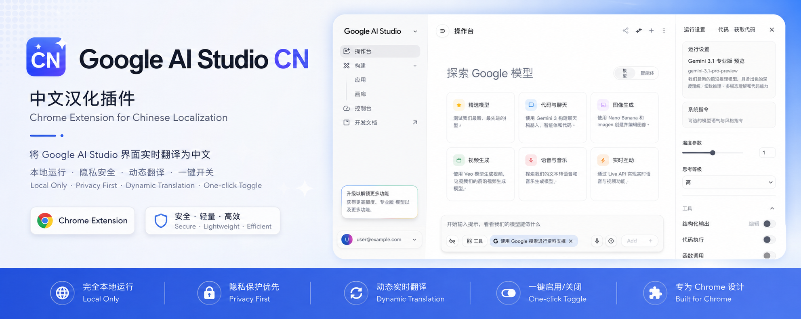
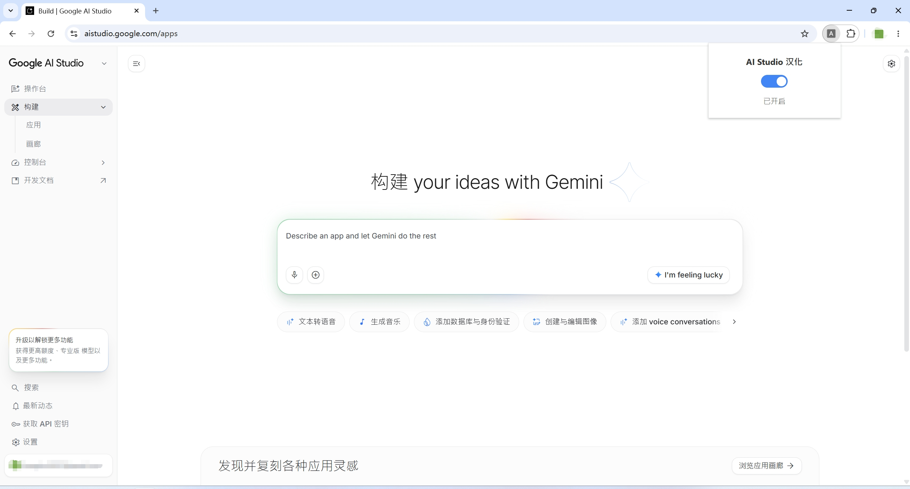
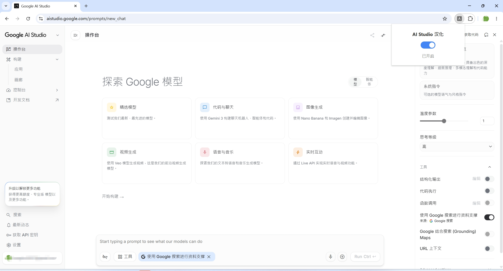
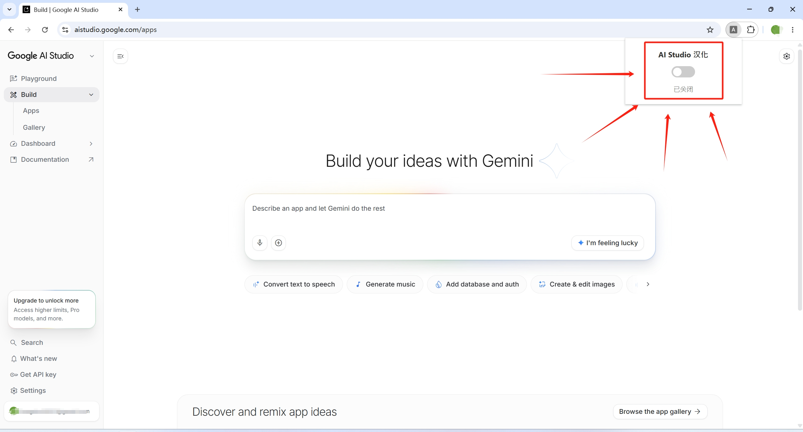
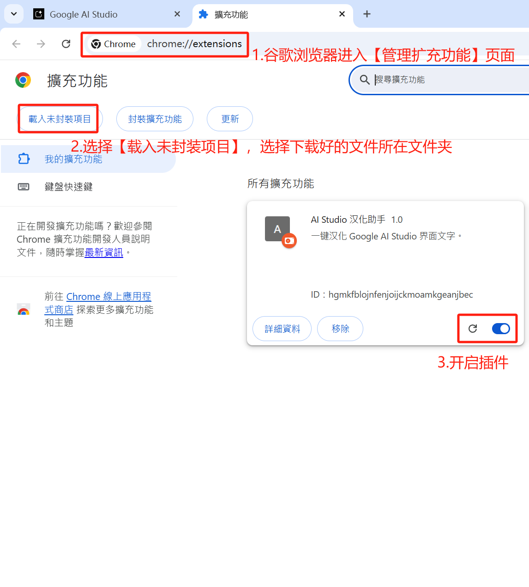

<div align="center">



<br>
<br>

# Google AI Studio CN

A lightweight Chrome extension for translating Google AI Studio into Chinese.  
Google AI Studio 中文汉化插件。

<br>


</div>

---

## Overview ｜ 项目简介

Google AI Studio CN is a lightweight Chrome extension designed to localize the Google AI Studio interface into Chinese.

Google AI Studio CN 是一个用于 Google AI Studio 的 Chrome 浏览器汉化插件。

It performs local DOM text replacement directly inside the browser, allowing users to switch between English and Chinese UI through a simple toggle.

插件通过浏览器本地文本替换实现界面中文化，并支持通过开关启用或关闭。

---

## Features ｜ 功能特点

- Chinese localization for Google AI Studio
- One-click translation toggle
- Dynamic page translation support
- Lightweight and local-only
- No server required
- Chrome Extension Manifest V3
- MutationObserver-based DOM detection
- Dynamic translation dictionary

---

## Preview ｜ 效果展示

### Translation Enabled ｜ 汉化开启

<div align="center">



<br><br>



</div>

---

### Original Interface ｜ 原始英文界面

<div align="center">



</div>

---

### Installation Guide ｜ 安装方式

<div align="center">



</div>

---

## Installation ｜ 安装教程

### 1. Download Repository ｜ 下载仓库

Download this repository as a ZIP file.

下载当前仓库的 ZIP 文件。

---

### 2. Extract Files ｜ 解压文件

Extract the ZIP file to a local folder.

将 ZIP 文件解压到本地目录。

---

### 3. Open Chrome Extensions ｜ 打开扩展程序页面

Open Chrome and visit:

打开 Chrome，并访问：

```text
chrome://extensions/
```

---

### 4. Enable Developer Mode ｜ 开启开发者模式

Enable the Developer Mode switch in the upper-right corner.

开启右上角的开发者模式。

---

### 5. Load Extension ｜ 加载插件

Click:

点击：

```text
Load unpacked
```

Then select the extracted project folder containing:

然后选择包含以下文件的项目根目录：

```text
manifest.json
```

---

## Usage ｜ 使用方法

1. Open Google AI Studio
2. Click the extension icon
3. Enable the translation switch
4. Refresh the page if necessary

1. 打开 Google AI Studio
2. 点击浏览器插件图标
3. 开启汉化开关
4. 如有需要，刷新页面

---

## Supported Pages ｜ 当前支持页面

- Home
- Build
- Gallery
- API Keys
- Settings
- Playground

---

## Technical Details ｜ 技术说明

### Core Technologies ｜ 核心技术

- Chrome Extension Manifest V3
- MutationObserver
- TreeWalker DOM traversal
- Local DOM text replacement
- Dynamic translation dictionary

### Technical Architecture ｜ 技术架构

The extension monitors DOM changes in real time and dynamically replaces predefined interface text with localized Chinese content.

插件通过监听页面 DOM 变化，对预设英文界面文本进行动态中文替换。

---

## Status ｜ 当前状态

This project is currently under active development. Translations are continuously being expanded and refined.

当前项目仍在持续开发中，翻译词典与页面支持将继续扩展和完善。

---

## Known Issues ｜ 已知问题

- Some dynamically loaded texts may require a page refresh
- Certain experimental pages are not fully translated yet

- 部分动态加载文本可能需要刷新页面
- 某些实验性页面尚未完全支持汉化

---

## Roadmap ｜ 后续计划

- Expand the translation dictionary
- Improve dynamic content detection
- Support more AI Studio pages
- Add multilingual support
- Publish to Chrome Web Store

- 扩展翻译词典
- 优化动态内容识别
- 支持更多 AI Studio 页面
- 增加多语言支持
- 发布 Chrome Web Store 版本

---

## License ｜ 开源协议

MIT License
